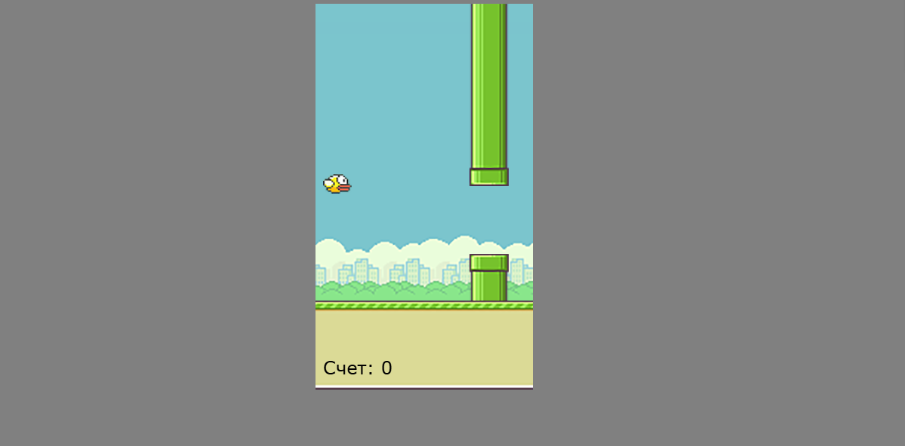

# Adil's Bird 🕹️🐦

This is a simple game created using HTML5 Canvas, where the player controls a bird, avoiding obstacles.

## Description ℹ️

This game is built using HTML5 Canvas and JavaScript. It allows the player to control a bird by pressing keys on the keyboard to fly upward and avoid obstacles.

## Screenshots

## How to Start the Game 🚀

To start the game:

1. Clone the repository to your computer: `git clone https://github.com/your-username/your-repo.git`
2. Open the `index.html` file in your browser.

## Game Instructions 🎮

- Use the spacebar or any other key to make the bird fly upward and avoid collisions with obstacles.
- The goal of the game is to survive as long as possible by avoiding collisions with the pipes.

## Important Files 📁

- `index.html`: main HTML file containing markup and the canvas.
- `js/script.js`: JavaScript code responsible for the game's logic.
- `img/`: folder containing images used in the game.

## Notes 📝

This is a basic version of the game and can be enhanced or improved to add new features or improve the interface.

